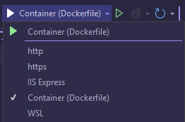

# ApexBI Technical Assessment Web API
## Setup
Clone repo to a local folder and open in Visual Studio.  
### Run Configurations
Once on Visual Studio you can the project in one of the configurations listed below: 
 

 
<strong>NB:</strong> To run the project using a Docker container you need Docker desktop installed and running on your devlopment machine. The API will also report dates in the time zone of the container or instance in Docker or Azure's app service.
## Spec
### Database Design
The API data is persisted in SQLite database. See data schema for Datasets and Sim Cards tables below:

### Endpoints

